# 지출 관리 특화 가계부 — 아키텍처 설계

## 1. 전체 구조 개요

메인 가계부(Core App)가 "지출 데이터 허브" 역할을 하고, 관리비/구독료/카드내역 등 서브 앱들이 각자 도메인에서 지출 이벤트를 생성해 메인으로 전달하는 구조입니다. 핵심 설계 원칙은 다음과 같습니다.

- **서브앱은 독립적으로 동작 가능**해야 함 (관리비 앱만 따로 써도 됨)
- **메인앱은 통합 대시보드/통계/분류**에 집중 (지출 분석 특화)
- **연동은 이벤트 기반(비동기) + 표준 API 계약**으로 결합도 최소화
- **모노레포**로 공통 코드(타입, UI, 인증 클라이언트) 재사용

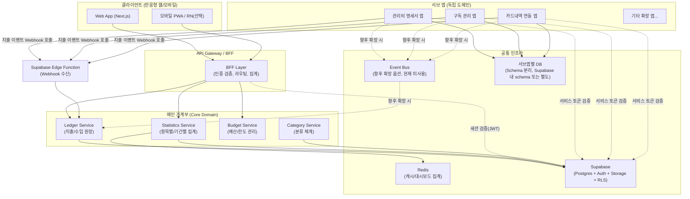

> 처음 단계(MVP)에서는 Event Bus 없이 **서브앱 → 메인앱 REST Webhook 호출**로 단순화해도 됩니다. 서브앱 수가 늘어나거나 재처리/순서보장이 필요해지면 이벤트 버스로 전환하는 것을 권장합니다. 아래 디렉토리 구조와 코드는 두 방식 모두 호환되게 `packages/event-contracts`로 추상화해둡니다.

---

## 1-1. 지출 데이터의 4가지 분류 축

실제 사용 데이터를 보면 지출 1건은 서로 독립된 4개의 축을 가집니다. 이 중 **지출분류/항목분류/지출처는 필수**, **상세내용만 선택**입니다.

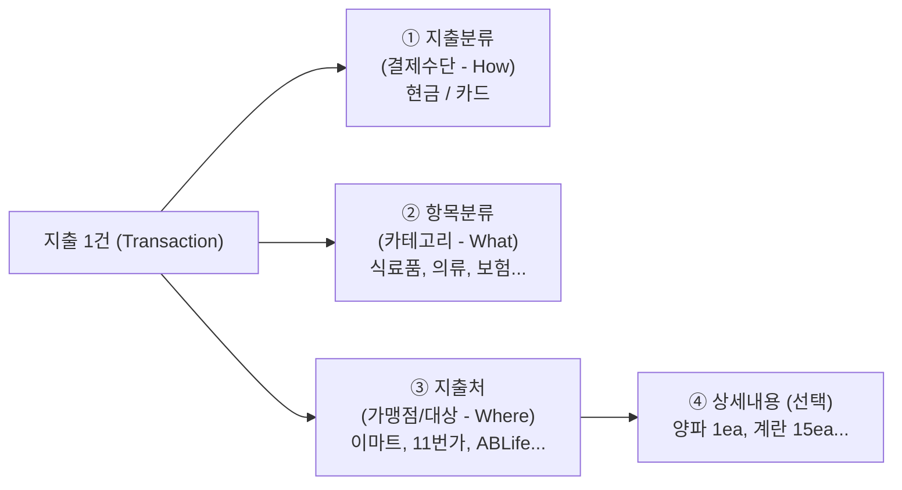

### ① 지출분류 (결제수단) 계층

기존 설계에는 이 축이 빠져 있었습니다. "현금/카드"는 카테고리(항목분류)와 무관하게 **별도로 관리되고, 카드는 사용자가 등록하면 카드사 기준 집계가 되어야** 합니다.

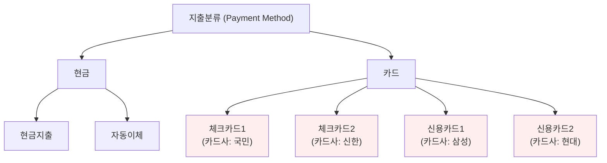

- 사용자가 "카드 등록" 시 **카드 별칭(체크카드1)** + **카드사(국민/신한 등)** + **카드 종류(체크/신용)** 를 입력 → 이후 "카드사별 집계", "체크 vs 신용 집계"가 가능해집니다.
- 현금은 시스템 기본 제공(현금지출/자동이체) 고정 — 사용자가 추가할 필요 없음 (필요시 확장 가능하게는 열어둠).

### ② 항목분류

시스템 기본 카테고리 제공 + 사용자 CRUD 가능 (이전 설계와 동일).

### ③ 지출처 + ④ 상세내용 (금액 입력 구조)

**Q. 상세항목에도 금액을 입력하나요?** → 네. 상세항목을 쓰는 순간 **금액은 상세항목 레벨에서 입력**되고, 지출처(Transaction)의 총액은 **상세항목 합계로 자동 계산**됩니다. 상세항목이 없으면 지출처(Transaction)에 금액을 직접 입력합니다. 즉 "금액을 어디에 입력하는가"는 상세항목 사용 여부에 따라 자동으로 갈립니다.

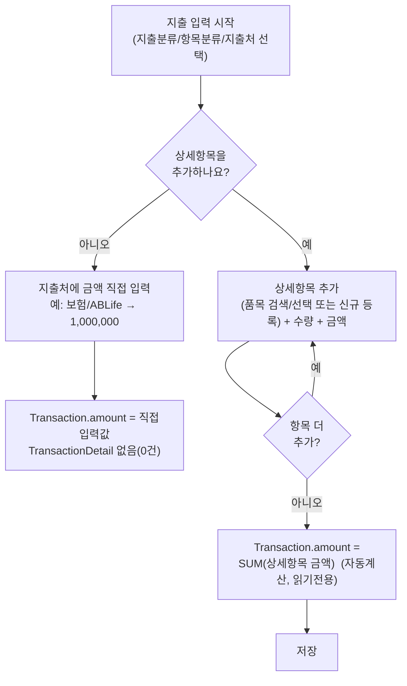

- **상세항목이 1개뿐인 경우**(예: 의류/11번가/청바지 239,000원)도 구조상 상세항목 1건으로 취급 — 총액과 상세금액이 같아도 데이터는 "상세항목 보유" 케이스로 저장합니다. (단순 입력에서는 "상세 안 씀, 금액 239,000 직접입력"도 허용 — 사용자가 둘 중 편한 방식 선택)
- 상세항목을 1건이라도 추가하면 **Transaction.amount는 합계 자동계산 + UI에서 직접 수정 잠금**(데이터 정합성 보장) — 다만 영수증 부가세/할인 등으로 합계가 안 맞을 수 있어 "조정금액" 필드를 별도로 둘 수 있음(아래 ERD에 `adjustment_amount` 반영)

### ⑤ 상세항목 마스터화 — 집계를 위한 정규화

"양파"가 입력될 때마다 자유 텍스트로 따로 저장되면 Top10 집계가 불가능합니다. **항목분류(Category)와 동일한 패턴**으로, 상세항목도 사용자별 마스터 테이블(`ITEM`)로 정규화합니다.

**alias는 누가 관리하나?** → **운영자(시스템)와 사용자가 역할을 나눠 관리**합니다.

| 주체              | 역할                                                                                                                  | 예시                                                                       |
| ----------------- | --------------------------------------------------------------------------------------------------------------------- | -------------------------------------------------------------------------- |
| **운영자/시스템** | "흔히 같은 의미로 쓰이는 식자재/품목" 후보를 담은 **참고용 동의어 사전**(`SYNONYM_DICTIONARY`)을 미리 큐레이션해 제공 | 양파↔양파(1개), 대파↔파, 마늘↔깐마늘 등 → DB에 미리 등록, 전체 사용자 공통 |
| **사용자**        | 동의어 사전은 어디까지나 **"제안"** 일 뿐, 실제로 두 품목을 같은 것으로 합칠지는 **사용자가 최종 확인/승인**          | "혹시 기존 '파'와 같은 품목인가요?" 알림에 사용자가 예/아니오 선택         |

> 자동으로 "보이는 글자가 비슷하니까 무조건 합친다"는 방식은 절대 쓰지 않습니다. 마늘/깐마늘처럼 실제로는 가격대가 다른 별도 품목일 수도 있기 때문에, 시스템은 **후보 제안**까지만 하고 **병합 실행은 항상 사용자 액션**으로 이뤄집니다.

### 사용자 입력 관점 Flow — "상세항목 입력 시 무슨 일이 일어나는가"

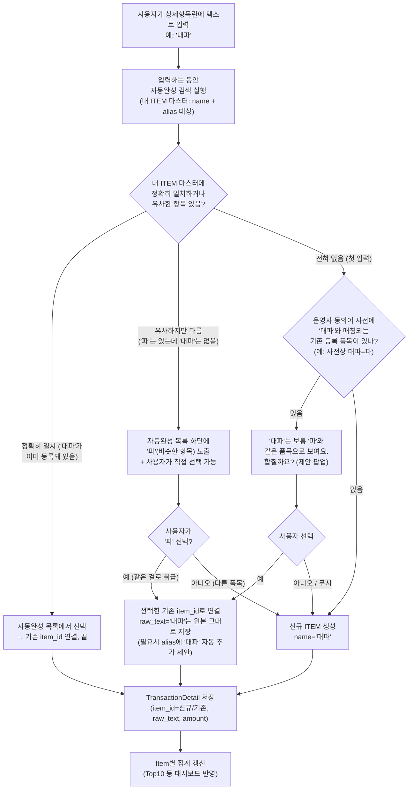

**단계별 설명**

1. **자동완성 우선**: 사용자가 글자를 입력하는 즉시 "내가 이전에 등록한 ITEM"(이름+별칭) 중 일치/유사한 것을 보여줍니다. 대부분의 반복 입력(매번 "양파")은 여기서 1번 클릭으로 끝납니다.
2. **유사 후보 노출**: 정확히 일치하지 않아도 자카드 유사도/편집거리 기준으로 "이미 등록된 비슷한 품목"이 있으면 자동완성 하단에 추천으로 띄웁니다. 선택 여부는 사용자 몫입니다.
3. **운영자 동의어 사전 활용**: 둘 다 없을 때(완전 신규 입력)만 운영자가 미리 등록해둔 공통 동의어 사전을 참고해 "이미 있는 항목과 합칠지" 1회 제안합니다. 이 사전은 전체 사용자 공통이며 운영자가 주기적으로 업데이트/관리합니다(관리자 화면에서 CRUD).
4. **항상 신규 생성이 기본값(Fallback)**: 사용자가 제안을 무시하거나 아무 후보도 없으면 그냥 새 `ITEM`이 만들어집니다 — 데이터가 잘못 합쳐지는 것보다 "일단 따로 쌓이고 나중에 합치는 것"이 더 안전한 기본 동작입니다.
5. **사후 관리(품목 관리 화면)**: 자동완성 때 놓쳤거나 나중에 정리하고 싶을 때, 사용자는 "품목 관리" 화면에서 본인의 `ITEM` 목록을 보고 직접 여러 항목을 선택해 "병합하기"를 누를 수 있습니다 (이때 `merged_into_item_id` 세팅, 과거 집계 데이터는 자동 재계산).

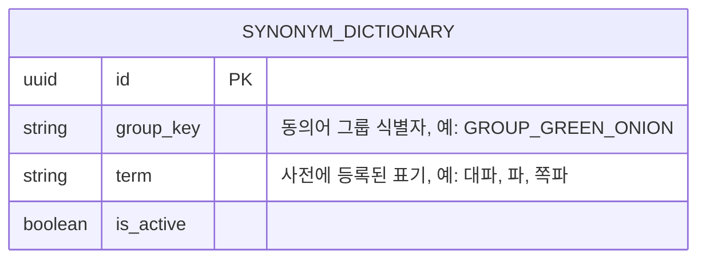

- `SYNONYM_DICTIONARY`는 **시스템 전역 테이블**(사용자 소유 아님) — 운영자 어드민 화면에서 그룹 단위로 단어를 추가/삭제합니다.
- 사용자의 `ITEM`/`alias`와는 별개의 "제안 소스"일 뿐, 실제 사용자 데이터(`ITEM.aliases`)에 자동으로 쓰여지지는 않습니다. 사용자가 "예"를 눌러야만 사용자의 `ITEM.aliases`에 반영됩니다.
- 이렇게 분리해두면 운영자가 사전을 잘못 등록해도 이미 사용자가 확정한 데이터에는 영향이 없고, 반대로 운영자 사전이 비어 있어도 사용자는 자동완성+수동 병합만으로 충분히 운영 가능합니다.

### ⑥ 수량/단위 입력 설계 — "1개", "1ea", "1묶음", "1+1"

수량/단위는 **선택값**이지만, 막상 들어오는 값은 세 종류로 섞여 있습니다.

| 입력 예             | 구조화 가능 여부                                   | 처리 방식                                                           |
| ------------------- | -------------------------------------------------- | ------------------------------------------------------------------- |
| "1개", "1ea", "2kg" | 가능 (숫자 + 단위로 분리됨)                        | `quantity_value` + `unit_id`로 구조화 저장                          |
| "1묶음", "1팩"      | 가능 (단위가 비표준이어도 동일 패턴)               | 위와 동일, 단위 마스터에 없으면 신규 단위 후보로 제안               |
| "1+1"               | **불가능** (수량/단위 패턴이 아니라 프로모션 표기) | 구조화 실패 → 원본 텍스트만 보존, `quantity_value`/`unit_id`는 null |

**핵심 원칙: 구조화는 "되면 좋고, 안 되면 원본 텍스트만 남기는" optional 보강 레이어입니다.** 금액 집계(Top10 등)는 `amount` 기준이라 수량 구조화 성공 여부와 무관하게 항상 동작합니다. 수량 구조화는 "이 항목은 보통 몇 개씩, 어떤 단위로 사는가" 같은 부가 인사이트를 위한 것입니다.

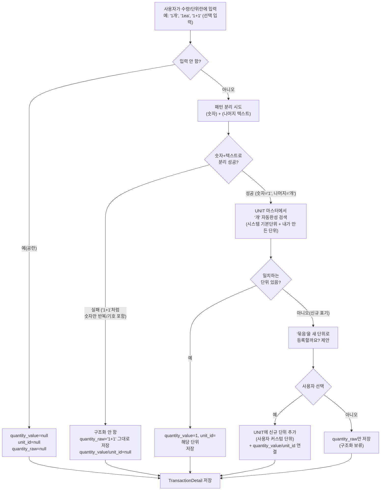

**UNIT 마스터가 필요한가? → 네, 가볍게 필요합니다.** 다만 ITEM처럼 무겁게 관리할 필요는 없습니다.

- **시스템 기본 단위 제공**: 개, ea, kg, g, L, ml, 봉, 팩, 묶음, box 등 자주 쓰는 단위를 미리 등록해두고, 자동완성에서 1순위로 노출합니다(전체 사용자 공통, `user_id = null`).
- **사용자 커스텀 단위**: 기본 목록에 없는 표기("줌", "단" 등)는 위 플로우처럼 1회 확인 후 사용자 전용 단위로 추가됩니다.
- **단위가 필요한 이유**: ① 입력 일관성(자동완성으로 "개"/"ea"/"EA" 같은 표기 흔들림 방지) ② 향후 "단가 분석"(예: 양파 1kg당 평균 가격 추이) 같은 고급 통계를 하려면 구조화된 단위가 있어야 함 — 지금 당장은 안 써도 데이터 구조는 미리 갖춰두는 것이 유리합니다.
- **검증은 느슨하게**: 수량/단위는 필수가 아니고, 구조화 실패도 정상 케이스로 취급("1+1"도 유효한 입력) — 사용자에게 에러를 띄우지 않고 그냥 원본 텍스트로 저장합니다.

---

## 2. 모노레포 디렉토리 구조

**도구**: pnpm workspace + Turborepo (빌드 캐시/병렬 실행), TypeScript 공통, Supabase CLI

```
household-finance-monorepo/
├── apps/
│   ├── main/                          # 메인 가계부 (Core)
│   │   ├── web/                       # Next.js (반응형 웹+모바일 웹)
│   │   │   ├── app/
│   │   │   │   ├── (auth)/login
│   │   │   │   ├── (dashboard)/
│   │   │   │   │   ├── overview/      # 종합 대시보드
│   │   │   │   │   ├── by-category/   # 항목별 분석
│   │   │   │   │   ├── by-transaction/# 내역별 분석
│   │   │   │   │   └── budget/
│   │   │   │   └── api/               # BFF Route Handlers
│   │   │   ├── components/
│   │   │   │   └── charts/            # 대시보드 차트 컴포넌트
│   │   │   └── ...
│   │   └── server/                    # 복잡 통계/배치 로직 전용 API (선택, 필요해지면 분리)
│   │       ├── src/
│   │       │   ├── statistics/        # 통계/집계 배치
│   │       │   ├── budget/
│   │       │   └── integration/       # 서브앱 Webhook 검증/처리 보조
│   │       └── ...
│   │
│   └── sub-apps/
│       ├── utility-bill/              # 관리비 명세서 앱
│       │   ├── web/                   # 독립 실행 가능한 UI(선택)
│       │   └── server/
│       │       ├── src/
│       │       │   ├── bill-parser/   # 명세서 OCR/파싱
│       │       │   ├── bill-schedule/ # 매월 발행 스케줄러
│       │       │   └── publisher/     # 메인앱 Webhook 호출
│       │       └── ...
│       ├── subscription/              # 구독료 관리 앱
│       └── card-statement/            # 카드내역 연동 앱
│
├── packages/
│   ├── ui/                            # 공통 디자인 시스템 (버튼, 차트 등)
│   ├── types/
│   │   └── database.generated.ts      # supabase gen types 결과물 (자동 생성)
│   ├── event-contracts/               # 서브앱-메인 연동 Webhook 페이로드 스펙(zod 스키마)
│   ├── supabase-client/                # Supabase 클라이언트 초기화 SDK (브라우저/서버 공용)
│   ├── config/                        # eslint, tsconfig, tailwind 공통 설정
│   └── utils/                         # 날짜/금액 포맷 등 공통 유틸
│
├── supabase/                          # Supabase 프로젝트 설정
│   ├── config.toml
│   ├── migrations/                    # SQL 마이그레이션 (Git 버전관리)
│   ├── functions/                     # Edge Functions (Deno)
│   │   ├── subapp-webhook-receiver/   # 서브앱 → 메인 지출 이벤트 Webhook 수신
│   │   └── item-stats-refresh/        # 통계 MV 리프레시 트리거(선택)
│   └── seed.sql                       # 로컬 개발용 시드 데이터
│
├── .github/
│   └── workflows/
│       ├── ci.yml                     # PR: lint/test/build
│       ├── deploy-migrations.yml      # main push: DB 마이그레이션
│       └── deploy-functions.yml       # main push: Edge Functions 배포
│
├── infra/                             # (선택) 자체 서버 배포 시 docker/배포 스크립트
│   └── docker/
│
├── turbo.json
├── pnpm-workspace.yaml
└── package.json
```

### 패키지 의존 관계

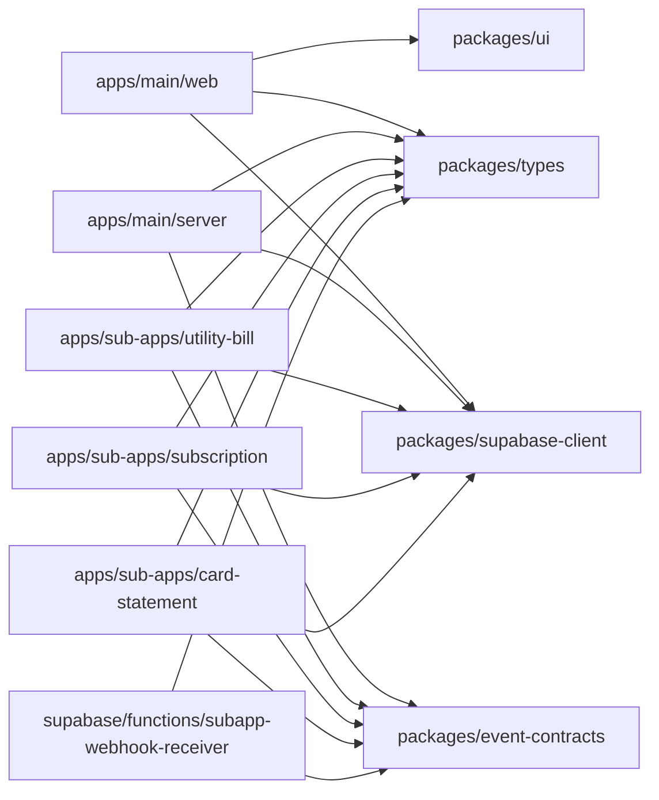

핵심은 **`event-contracts` 패키지**입니다. 여기에 "지출 이벤트" Webhook 페이로드의 스키마(zod/TypeBox)를 정의해두면, 서브앱이 추가될 때마다 이 계약만 지키면 메인앱(Supabase Edge Function 수신부) 코드를 건드릴 필요가 없습니다.

```ts
// packages/event-contracts/expense-event.ts
export const ExpenseEventSchema = z.object({
  sourceApp: z.enum(["utility-bill", "subscription", "card-statement"]),
  externalId: z.string(), // 서브앱 내부 ID (멱등성 키)
  userId: z.string(),
  amount: z.number(), // 합계 금액
  occurredAt: z.string().datetime(),
  category: z.string(), // 메인 카테고리로 매핑 전 서브앱 측 기본 카테고리(선택)
  memo: z.string().optional(),
  details: z
    .array(
      z.object({
        // 관리비처럼 명세가 있는 경우의 라인아이템
        itemCode: z.string(), // 예: ELECTRIC, WATER, COMMON_FEE
        itemName: z.string(), // 예: 전기료, 수도료, 공동관리비
        amount: z.number(),
      }),
    )
    .optional(), // 일상 지출과 달리 정형 명세에서만 사용
  raw: z.record(z.any()).optional(), // 원본 데이터 (상세보기용)
});
```

> 일상 지출(메인앱 직접 입력)은 이 스키마를 타지 않고, 메인앱 내부 API(`POST /transactions`, `input_type: MANUAL`)로 바로 들어갑니다. 이 스키마는 **서브앱 → 메인 Webhook 연동 전용 계약**이며, `supabase/functions/subapp-webhook-receiver`가 이 스키마로 페이로드를 검증합니다.

---

## 3. 사용자 인증 설계

> 인증은 자체 Auth 서버를 구축하지 않고 **Supabase Auth**를 사용합니다. 아래 설계의 "Auth Service"는 곧 Supabase Auth이며, JWT 발급/검증/Refresh Token 회전을 Supabase가 처리합니다. 서브앱-메인 서버간 인증은 Supabase의 **Service Role Key**(RLS 우회 권한)를 사용합니다. 상세 기술 스택은 8장 참고.

**방식: Supabase Auth 기반 중앙집중형 인증**

- 서브앱은 자체 로그인 화면을 만들지 않고, 메인앱(Supabase 프로젝트)에서 발급한 JWT를 신뢰합니다.
- 서브앱이 외부 서비스(예: 관리공단 사이트, 카드사)와 연동할 때 필요한 별도 인증정보는 서브앱이 암호화 보관(메인앱과 무관).

**기술 스택**

- 인증: **Supabase Auth** (이메일/소셜 로그인, JWT 발급, Refresh Token Rotation 기본 내장)
- 토큰: Supabase 발급 Access Token(JWT, 단명) + Refresh Token — 클라이언트는 `@supabase/ssr` 사용
- 서브앱-메인 서버 간 통신: **Supabase Service Role Key**로 서버간 인증(RLS 우회) + 자체 API 키 검증 레이어 추가 권장(서비스 키 노출 방지)
- 권한 분리: Postgres **RLS(Row Level Security) 정책**으로 `user_id = auth.uid()` 기준 데이터 접근 제어 — 애플리케이션 레벨 권한 체크와 이중 방어

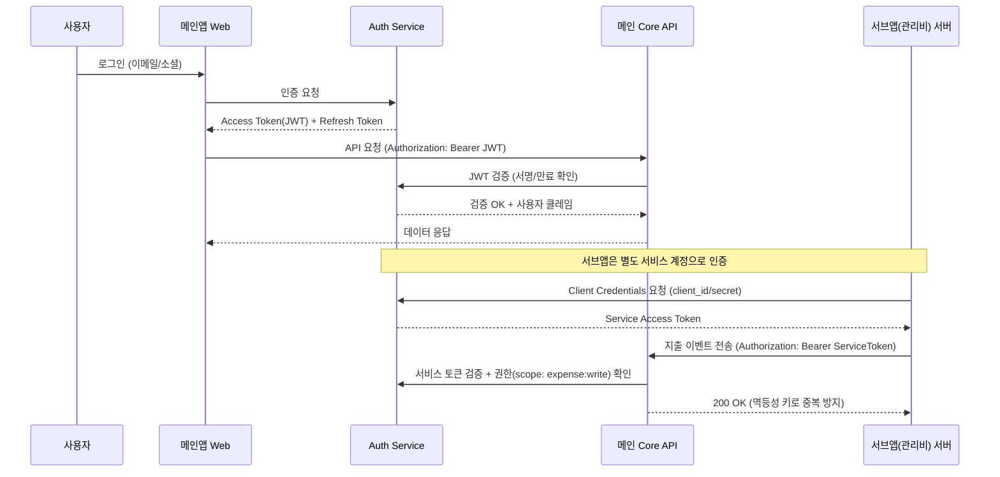

**서브앱의 사용자-메인앱 사용자 매핑**

- 서브앱이 사용자별 데이터를 메인에 보낼 때는 `userId`가 메인앱 기준 ID와 동일해야 합니다.
- 최초 서브앱 연결 시 OAuth 형태의 "계정 연결(Account Linking)" 플로우를 거쳐 `mainUserId ↔ subAppUserId` 매핑 테이블을 메인앱 DB에 저장합니다.

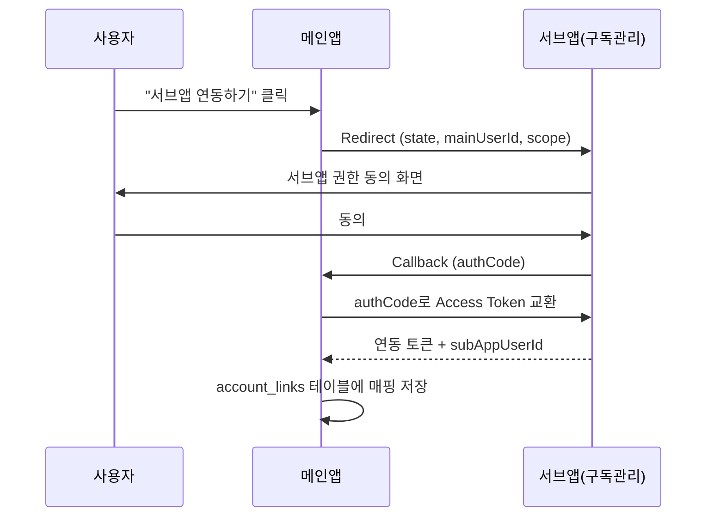

### 3-1. 세션 정책 (현재 적용 값)

> 최종 산출물(사용자 가이드, 운영 매뉴얼) 작성 시 참조할 수 있도록 기록합니다.

| 항목                           | 설정값                                                            | 비고                                                              |
| ------------------------------ | ----------------------------------------------------------------- | ----------------------------------------------------------------- |
| Access Token 유효시간          | 1시간 (`jwt_expiry = 3600`)                                       | 만료 시 Refresh Token으로 자동 갱신 — 사용자 체감 없음            |
| Refresh Token 갱신 방식        | 매 갱신마다 새 토큰 발급 (`enable_refresh_token_rotation = true`) | 탈취된 이전 토큰 자동 무효화                                      |
| Refresh Token 재사용 허용 구간 | 10초 (`refresh_token_reuse_interval = 10`)                        | 네트워크 재시도 대비                                              |
| 강제 로그아웃(세션 타임박스)   | 미설정                                                            | 필요 시 `supabase/config.toml`의 `[auth.sessions] timebox` 활성화 |
| 비활성 타임아웃                | 미설정                                                            | 금융 앱 보안 강화 필요 시 `inactivity_timeout = "30m"` 권장       |

**사용자 관점 요약**: 앱을 사용하는 동안 자동으로 세션이 유지됩니다. 명시적으로 로그아웃하거나, 동일 계정에서 비정상적인 재로그인이 감지될 때 세션이 종료됩니다.

---

## 4. 데이터 모델 (핵심 ERD)

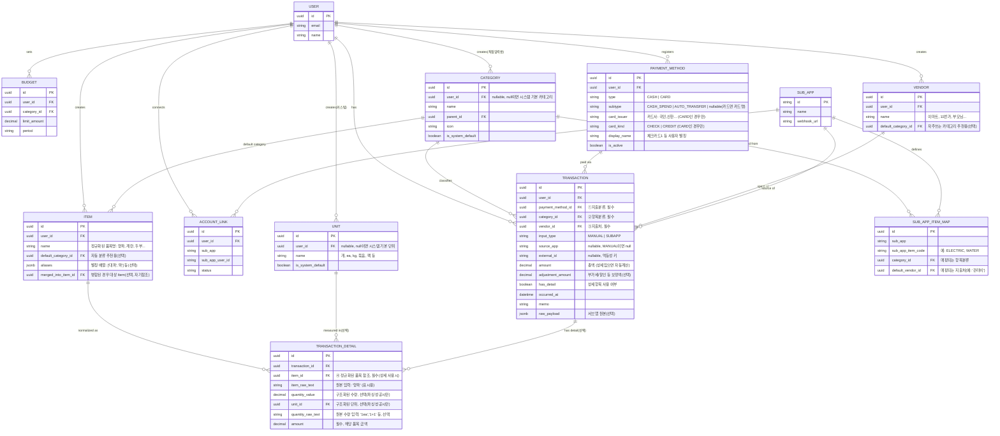

**핵심 설계 포인트**

- **`PAYMENT_METHOD`(지출분류) 신규**: 현금(현금지출/자동이체, 시스템 고정) + 카드(사용자 등록, 카드사/카드종류 보유) → 카드사별/현금-카드별 집계 쿼리가 `payment_method_id`로 바로 가능해집니다.
- **`VENDOR`(지출처) 신규**: 트랜잭션의 **필수** FK. "부모님", "조카"처럼 사람도 지출처로 등록 가능. `default_category_id`로 "이마트는 보통 식료품" 같은 자동완성 추천을 지원할 수 있습니다.
- **`ITEM`(상세항목 마스터) 신규**: 자유 텍스트였던 `item_name`을 마스터 엔티티로 분리해, 같은 품목("양파")이 여러 지출처/여러 건에서 입력돼도 `item_id`로 묶여 Top10 집계가 가능해집니다. `aliases`로 유사 표기를 묶거나 `merged_into_item_id`로 중복 생성된 항목을 사후 병합할 수 있습니다.
- **`UNIT`(단위 마스터) 신규**: ITEM과 동일한 패턴의 가벼운 마스터. 시스템 기본 단위(개/ea/kg/묶음 등) + 사용자 커스텀 단위. `TRANSACTION_DETAIL.unit_id`로 참조하되 **필수 아님** — 구조화 실패("1+1" 등)는 `quantity_raw_text`에만 남고 `unit_id`/`quantity_value`는 null.
- **`TRANSACTION_DETAIL.amount`는 필수(상세 사용 시)**: 상세항목을 쓰면 금액은 상세항목 레벨에 입력되고, `Transaction.amount`는 합계로 자동계산됩니다(`has_detail = true`일 때 읽기전용). 상세항목을 안 쓰면 `Transaction.amount`에 직접 입력합니다.
- **`Transaction.adjustment_amount`**: 영수증 부가세/할인 등으로 상세 합계와 총액이 정확히 안 맞을 때 보정용으로 둔 필드(선택). 기본은 0.
- **`TRANSACTION.payment_method_id` / `vendor_id` 모두 필수(NOT NULL)**, `category_id`도 필수 — 즉 지출 1건은 항상 **지출분류 + 항목분류 + 지출처** 3박자를 갖습니다.
- **`SUB_APP_ITEM_MAP`에 `default_vendor_id` 추가**: 관리비 서브앱이 보내는 데이터는 지출처가 보통 고정("관리사무소")이므로, 항목 매핑 시 지출처도 함께 자동 지정되게 합니다.
- **`Category.user_id`**: 사용자가 직접 만든 카테고리(`user_id` 존재)와 시스템 기본 카테고리(`is_system_default = true`)를 구분합니다. 사용자는 자유롭게 추가/수정/삭제(CRUD)할 수 있습니다.
- `Transaction.external_id + source_app`은 `input_type = SUBAPP`일 때만 유니크 제약으로 걸어 멱등성을 보장합니다.

---

## 5. 대시보드/통계 특화 설계

지출 관리 특화 요구사항을 위해 통계 전용 서비스를 분리합니다. **`TRANSACTION`(지출처/지출분류/항목분류 집계)과 `TRANSACTION_DETAIL`(상세품목 집계)은 별도의 집계 레벨**로 동시에 운영합니다 — 합계 레벨과 품목 레벨 통계는 쿼리/캐시 단위가 다르기 때문입니다.

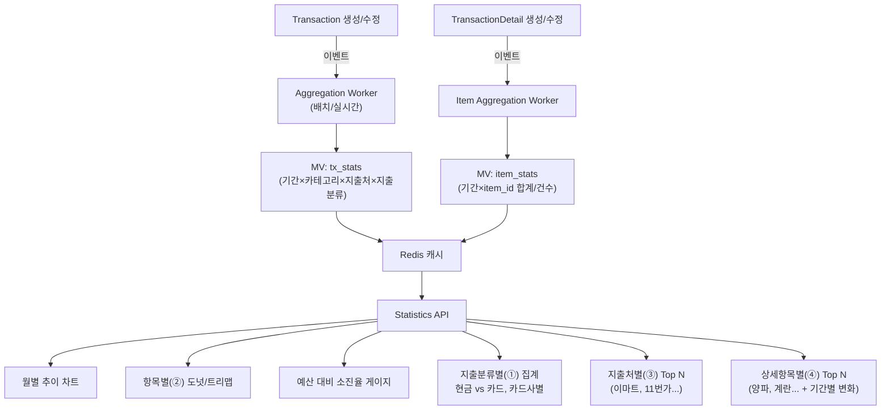

### 상세항목(Item) Top10 집계 설계 포인트

- **`item_stats` Materialized View**: `(user_id, item_id, period)` 기준으로 `SUM(transaction_detail.amount)`, `COUNT(*)`, `AVG(amount)`를 미리 집계해둡니다. 매번 raw 테이블을 join/group by 하면 품목 수가 늘어날수록 느려지므로 필수입니다.
- **Top N 쿼리**: `item_stats`에서 기간 필터 후 `total_amount DESC LIMIT 10` — 캐시(Redis)에 `item_top10:{userId}:{period}` 키로 저장해 대시보드 진입 시 즉시 응답.
- **드릴다운 지원**: Top10에서 "양파" 클릭 → 어느 지출처(이마트/마트 등)에서 얼마씩 샀는지 상세 리스트로 이어지는 UX (item_id로 transaction_detail → transaction → vendor 역추적)
- **병합(Merge) 처리**: 사용자가 "양파"와 "대파"를 같은 항목으로 합치면 `merged_into_item_id`를 세팅하고, 집계 쿼리는 `COALESCE(merged_into_item_id, id)` 기준으로 그룹화 — 과거 데이터를 다시 쓰지 않고도 합산 가능.
- **카테고리 미사용 품목도 추적 가능**: `Item.default_category_id`가 없어도 집계 자체는 `item_id` 기준이라 분류 체계와 무관하게 동작 — 사용자가 나중에 분류를 채워도 과거 집계가 깨지지 않습니다.

### 수량 기반 통계 (단가 분석)

**가능합니다 — 단, "구조화 성공한 레코드만" 필터링하고, "단위가 같은 것끼리만" 묶어야 의미 있는 숫자가 나옵니다.**

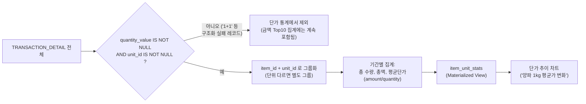

- **제외 기준**: `quantity_value`가 null인 레코드(=구조화 실패, "1+1" 류)는 단가 통계에서 자동 제외됩니다. 다만 **금액 자체는 빠지지 않습니다** — Top10 금액 집계(`item_stats`)에는 여전히 포함되고, 오직 "수량 기반" 통계(`item_unit_stats`)에서만 빠지는 구조입니다. 즉 같은 데이터가 통계 종류에 따라 포함/제외가 갈립니다.
- **`item_unit_stats` 뷰**: `(user_id, item_id, unit_id, period)` 단위로 `SUM(quantity_value)`, `SUM(amount)`, `AVG(amount/quantity_value)`를 집계 → "양파(kg 단위) 평균 단가가 이번 달 얼마나 올랐는지" 같은 추이 차트를 만들 수 있습니다.
- **단위가 섞여 있으면 합치지 않음**: 같은 "양파"라도 어떤 건 "개"로, 어떤 건 "kg"로 등록됐다면 `unit_id`가 다르므로 자동으로 별도 그룹이 됩니다. 두 단위를 하나로 합산(예: 1kg = 약 4개)하려면 별도의 **단위 환산 테이블**(`UNIT_CONVERSION`, 추후 확장 단계)이 필요한데, 이건 정확도 이슈가 있어 1단계에서는 "같은 단위끼리만 비교"로 충분히 가치 있는 통계가 나옵니다.
- **표시 예시**: "이번 달 양파 구매: 3.2kg, 총 9,600원, kg당 평균 3,000원 (지난달 대비 +5%)" — 단, "1+1"으로 산 양파는 이 평균단가 계산에서는 빠지고 총 지출(Top10)에는 포함됩니다.

- 트랜잭션/상세항목 발생 시 **즉시 집계 업데이트**(소규모 가계부 데이터량 기준 실시간 집계로 충분) → 사용자 늘면 배치/CQRS로 전환
- 프론트 차트 라이브러리: Recharts/Visx + 반응형 그리드 레이아웃(모바일 1열, 데스크탑 다열)

---

## 6. 반응형 웹/모바일 대응

- **단일 코드베이스**: Next.js (App Router) + Tailwind 반응형 브레이크포인트로 웹/모바일 웹 동시 대응
- 모바일 네이티브가 필요해지면 `apps/main/mobile` (React Native + Expo)를 추가하고 `packages/supabase-client`, `packages/types`를 그대로 재사용
- PWA 매니페스트 적용으로 홈 화면 추가/오프라인 캐시 지원

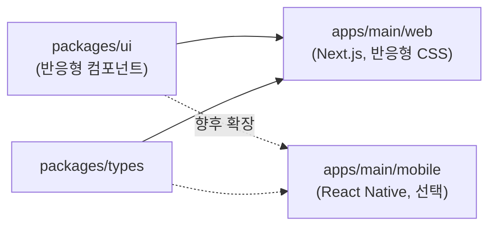

---

## 7. 단계별 구축 로드맵 제안

| 단계  | 범위                                                                                                     |
| ----- | -------------------------------------------------------------------------------------------------------- |
| 1단계 | Supabase 프로젝트 생성/GitHub 연동, 메인앱(Core) + Supabase Auth + 수동 입력 기반 가계부 + 기본 대시보드 |
| 2단계 | `event-contracts` 정의, 관리비 서브앱 1개 연동 (Webhook 방식)                                            |
| 3단계 | 통계 서비스 분리, 캐시 도입, 대시보드 고도화                                                             |
| 4단계 | 서브앱 추가(구독/카드), Event Bus로 전환, 계정 연결 플로우 정식화                                        |

---

## 8. 기술 스택 & GitHub 관리 / CI-CD

### 8-1. 기술 스택 한눈에 보기

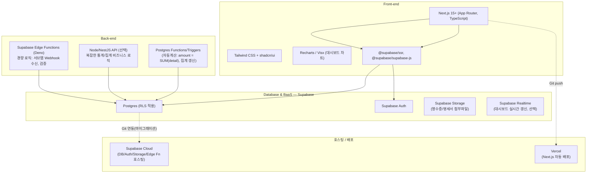

| 영역                             | 선택 기술                                                           | 비고                                                                            |
| -------------------------------- | ------------------------------------------------------------------- | ------------------------------------------------------------------------------- |
| Front-end                        | **Next.js(App Router) + TypeScript + Tailwind + shadcn/ui**         | 반응형 웹/모바일 웹 단일 코드베이스                                             |
| 상태/데이터 fetching             | **TanStack Query** + Supabase JS client                             | 캐싱, 낙관적 업데이트(지출 입력 시 즉시 반영)                                   |
| 차트                             | **Recharts** (기본) / 필요시 Visx로 커스텀                          | 대시보드 특화 요구사항 충족                                                     |
| Back-end (경량)                  | **Supabase Edge Functions (Deno/TypeScript)**                       | 서브앱 Webhook 수신, 멱등성 체크, 간단한 검증 로직                              |
| Back-end (복잡 로직, 선택)       | **Node.js + NestJS** (또는 Next.js Route Handler로 시작 후 분리)    | 통계 집계 배치, 복잡한 비즈니스 규칙이 늘어나면 별도 분리                       |
| DB                               | **Supabase (PostgreSQL)**                                           | RLS로 사용자별 데이터 격리, 기존 ERD 그대로 적용                                |
| 인증                             | **Supabase Auth**                                                   | 이메일/소셜 로그인, JWT, Refresh Token Rotation                                 |
| 파일 저장                        | **Supabase Storage**                                                | 관리비 명세서 PDF, 영수증 이미지                                                |
| 캐시 (선택, 통계 가속용)         | **Upstash Redis** (서버리스 Redis)                                  | Vercel/Edge 환경과 호환 좋음. 초기엔 Postgres Materialized View만으로 시작 가능 |
| 모노레포 툴링                    | **pnpm workspace + Turborepo**                                      | 기존 설계 유지                                                                  |
| 호스팅 (프론트)                  | **Vercel (기본 권장)** 또는 자체 서버+GitHub Actions/Coolify (선택) | 외부 PaaS는 필수 아님 — 8-3-1 참고                                              |
| 호스팅 (DB/Auth/Storage/Edge Fn) | **Supabase Cloud** (또는 self-hosted Supabase)                      | GitHub 연동 시 자동 마이그레이션                                                |

> **서브앱 연동 구현 방식: Webhook으로 확정.** 서브앱 → 메인 지출 이벤트 전달은 Event Bus(Kafka 등) 없이 **Supabase Edge Function이 Webhook을 직접 수신**하는 방식으로 구현합니다 (1장의 Event Bus는 현재 미사용, 점선으로만 표시된 미래 확장 경로입니다). 다만 향후 서브앱 수가 많아지거나 재처리/순서 보장이 필요해지면 Upstash Kafka 같은 서버리스 메시징으로 전환할 수도 있다는 점은 옵션으로 남겨둡니다.

### 8-2. GitHub 저장소/브랜치 전략

> **중요: Supabase GitHub 연동 ≠ 앱 소스코드 배포.** Supabase의 GitHub 연동은 **저장소 안의 `supabase/` 폴더(마이그레이션 SQL, `config.toml`, Edge Functions)만 감지하고 처리**합니다. `apps/main/web` 같은 Next.js 앱 소스코드 변경은 Supabase가 전혀 신경 쓰지 않습니다 — 그건 별개로 Vercel(또는 다른 호스팅)의 GitHub 연동이 담당합니다. 즉 **한 저장소에 두 개의 독립적인 Git 연동이 동시에 붙어있는 구조**입니다.

| 연동 주체                            | 감지 대상(working directory)    | 하는 일                                                                           | 안 하는 일                                   |
| ------------------------------------ | ------------------------------- | --------------------------------------------------------------------------------- | -------------------------------------------- |
| **Supabase GitHub 연동**             | `supabase/` 폴더만              | PR마다 Preview DB 브랜치 생성, 마이그레이션 자동 적용, (옵션) Edge Functions 배포 | 프론트/백엔드 앱 빌드·배포는 전혀 관여 안 함 |
| **Vercel(또는 별도 CI) GitHub 연동** | `apps/main/web` 등 앱 소스 전체 | push/PR마다 앱 빌드 + Preview/Production 배포                                     | DB 마이그레이션은 관여 안 함                 |

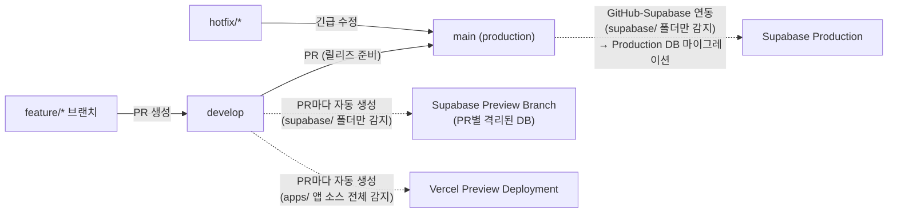

- **저장소 구조**: 1개의 모노레포(GitHub repo) — `apps/main`, `apps/sub-apps/*`, `packages/*`, 그리고 **`supabase/`** 폴더(마이그레이션 SQL, Edge Functions, `config.toml`)를 루트에 둡니다. Supabase 연동 설정 시 "Working directory"를 `.`(루트) 또는 `supabase/`의 상위 경로로 지정해, **레포 안의 그 폴더만** 보게 합니다.
- **브랜치 전략**: `main`(운영) ← `develop`(통합) ← `feature/*`(개별 작업). 작은 팀이면 `develop` 없이 `main` 직행 + PR 리뷰만으로 단순화 가능.
- **PR 규칙**: PR 생성 시 GitHub Actions가 lint/typecheck/test 실행 → `supabase/` 폴더에 변경이 있으면 Supabase가 **PR별 Preview DB 브랜치**를 자동 생성(마이그레이션 자동 적용, 운영 데이터는 복제 안 됨) → `apps/` 폴더에 변경이 있으면 Vercel이 **Preview 배포**를 자동 생성 → PR 코멘트에 두 링크가 각각 자동으로 달립니다. **두 변경이 동시에 일어나도(예: 신규 컬럼 추가 + 그 컬럼 쓰는 화면 추가) 서로 독립적으로 동작**하기 때문에, 배포 순서를 직접 신경 쓸 필요는 없지만 "DB 마이그레이션이 먼저 적용된 뒤 그걸 쓰는 코드가 배포되는지"는 PR 머지 순서로 관리해야 합니다.

### 8-3. CI/CD 파이프라인

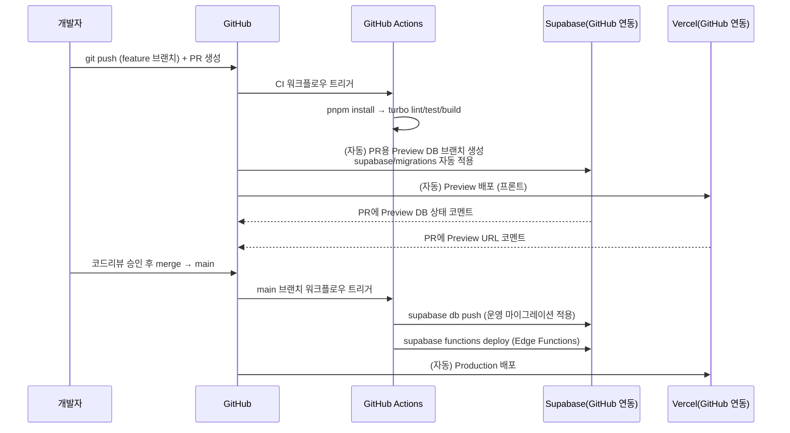

- **DB 마이그레이션**: `supabase/migrations/*.sql`을 Git으로 버전관리 → PR마다 Preview 브랜치에 자동 적용되어 "이 변경이 스키마를 깨뜨리는지" PR 단계에서 바로 확인 가능. `main` 머지 시 GitHub Actions에서 `supabase db push`로 운영 DB에 반영.
- **Edge Functions 배포**: `supabase/functions/*` 변경 시 GitHub Actions에서 `supabase functions deploy` 실행.
- **타입 동기화**: `supabase gen types typescript`로 DB 스키마 → TypeScript 타입 자동 생성, `packages/types`에 반영 → 프론트/백엔드가 항상 최신 DB 스키마와 타입 일치 (CI에서 "생성된 타입과 실제 커밋 내용이 다르면 빌드 실패"로 drift 방지)
- **프론트 배포**: 아래 8-3-1에서 다루는 방식 중 하나를 선택해 push/merge 시 자동 배포되도록 구성.
- **시크릿 관리**: `SUPABASE_ACCESS_TOKEN`, `SUPABASE_DB_PASSWORD`, `SUPABASE_SERVICE_ROLE_KEY` 등은 GitHub Actions Secrets에 등록, 서브앱 저장소도 동일 패턴 적용.

#### 8-3-1. 앱 소스코드 Git 연동 — 외부 호스팅(PaaS)이 꼭 필요한가?

**아니요, 필수는 아닙니다.** "push/merge하면 자동으로 뭔가 실행되는 것" 자체는 **GitHub Actions만으로 충족됩니다** — 이건 GitHub의 기본 기능이고 외부 서비스가 아닙니다. Vercel 같은 PaaS는 "그 결과를 어디서 호스팅할지"에 대한 선택지 중 하나일 뿐, 유일한 방법은 아닙니다.

| 방식                                                           | Git 연동 방법                                                                                                      | 외부 서비스 의존                    | 운영 부담                                              | 비고                                                                  |
| -------------------------------------------------------------- | ------------------------------------------------------------------------------------------------------------------ | ----------------------------------- | ------------------------------------------------------ | --------------------------------------------------------------------- |
| **A. Vercel/Netlify 등 PaaS**                                  | PaaS의 GitHub 연동(자동)                                                                                           | 있음(Vercel 등)                     | 거의 없음 — 설정만 하면 끝                             | 가장 간단, 1인/소규모 팀에 추천                                       |
| **B. 자체 서버 + GitHub Actions (SSH 배포)**                   | GitHub Actions 워크플로우에서 `main` push 시 자체 서버에 SSH 접속 → `git pull` + 빌드 + 재시작(pm2/systemd/docker) | 없음 (보유한 VPS/서버만 있으면 됨)  | 서버 관리 직접 필요 (OS 패치, 무중단 배포 스크립트 등) | "외부 PaaS 없이 자동 배포"의 표준 패턴                                |
| **C. 자체 서버 + Self-hosted Runner**                          | GitHub Actions Self-hosted Runner를 본인 서버에 직접 설치 → push 이벤트가 그 서버에서 바로 실행됨                  | 없음                                | 러너 보안/유지보수 필요                                | B보다 한 단계 더 직접적인 제어                                        |
| **D. 자체 서버 + Coolify/Dokploy (오픈소스 self-hosted PaaS)** | 본인 서버에 Coolify 등을 설치, GitHub 연동 기능으로 push 감지 → 자동 빌드/배포 (Vercel과 유사한 UX)                | 없음 (오픈소스, 본인 서버에서 구동) | 중간 — 초기 설치만 하면 이후엔 PaaS처럼 편함           | "B의 번거로움"과 "A의 외부 의존" 사이의 절충안, 최근 많이 쓰이는 방식 |

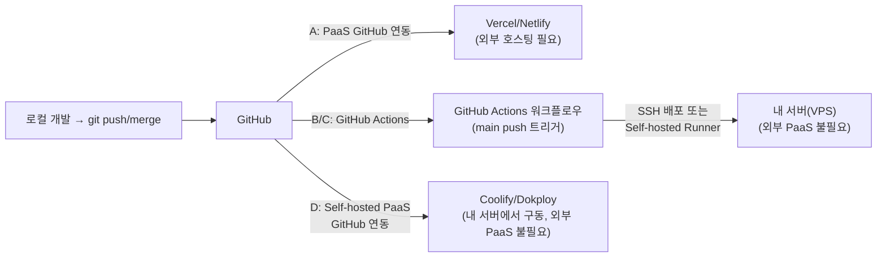

- **이미 보유한 서버(VPS/홈서버 등)가 있다면** B~D 방식으로 외부 PaaS 없이 충분히 "push하면 자동 배포"를 구현할 수 있습니다. 가장 손이 덜 가는 건 **D(Coolify 등)** — Vercel과 비슷한 UX를 내 서버에서 그대로 누릴 수 있습니다.
- **서버가 없고 간단하게 시작하고 싶다면** A(Vercel)가 가장 빠릅니다. Vercel 무료 티어로도 개인 프로젝트 규모는 충분히 커버됩니다.
- **Supabase는 어느 방식을 택해도 무관**합니다 — 8-2/8-3에서 다룬 Supabase GitHub 연동(DB 마이그레이션)은 프론트 배포 방식과 완전히 독립적으로 동작합니다.
- 이 설계서에서는 8-1~8-3 전반에 Vercel을 기본값으로 예시를 들었지만, 실제 구현 시 **A~D 중 환경에 맞는 방식으로 자유롭게 교체 가능**합니다 (코드/워크플로우 구조 자체는 거의 동일, "배포 타겟"만 달라짐).

---

## 다음으로 진행하면 좋은 것

- 지금까지의 ERD를 바탕으로 **`supabase/migrations` 실제 SQL + RLS 정책** 초안 작성
- GitHub Actions 워크플로우 파일(`ci.yml`, `deploy-migrations.yml`) 실제 작성
- `event-contracts` 패키지의 실제 zod 스키마 + Edge Function(Webhook 수신) 샘플 코드 작성
- 대시보드 화면의 와이어프레임/목업 제작
